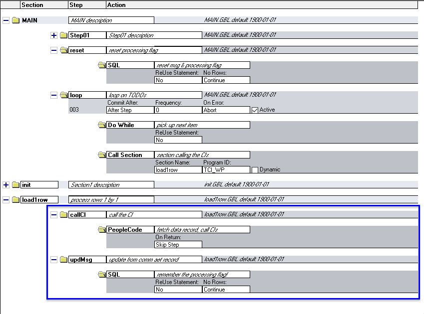
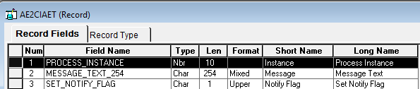
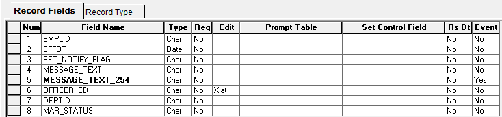

## Part 3 Appendix (Records and Application Engine schema)

### The Application Engine

(we care about the part in the blue box)

`SQL.Main.reset`

This is where we reset the rows for processing, with `S` for *Staged*. Looking at `Y` means *loaded already*. `B`, which the CI wrapper does not care about, means *Blocked*. And `D` means *Delete*, which we are not using here.

	UPDATE PS_TCI_SOURCE
	SET SET_NOTIFY_FLAG = 'S' ,MESSAGE_TEXT_254 = ' '
	WHERE SET_NOTIFY_FLAG NOT IN ('Y', 'B', 'D') ;

`SQL.Main.loop`

	%Select(EMPLID, AE2CIAET.SET_NOTIFY_FLAG)
	SELECT EMPLID
	, CASE SET_NOTIFY_FLAG WHEN 'D' THEN 'D' ELSE 'I' END
	FROM PS_TCI_SOURCE /* S stands for staged here */
	WHERE SET_NOTIFY_FLAG IN ('S','D')
	ORDER BY EMPLID ;

#### `SQL.load1row.updMsg`:

This step is very important for loop management and user feedback. Coming after `load1row.callCI`, which calls the wrapper, its job is to take the notification and message fields in `Record.AE2CIAET` and put them into the data record (`TCI_SOURCE`) for that EMPLID. At this point, the CI's response codes have NOT been written to the database yet, since there was always the possibility of a rollback.

	UPDATE PS_TCI_SOURCE
  	SET MESSAGE_TEXT_254 = %Bind(AE2CIAET.MESSAGE_TEXT_254), SET_NOTIFY_FLAG = %Bind(AE2CIAET.SET_NOTIFY_FLAG)
 	WHERE EMPLID = %Bind(EMPLID)

#### `Record.AE2CI`:

This is the *communication* Record used to exchange information without saving into the database (remember those CI-initiated rollbacks).

### `Record.TCI_SOURCE`

This is **your** data record that you want to load.

		